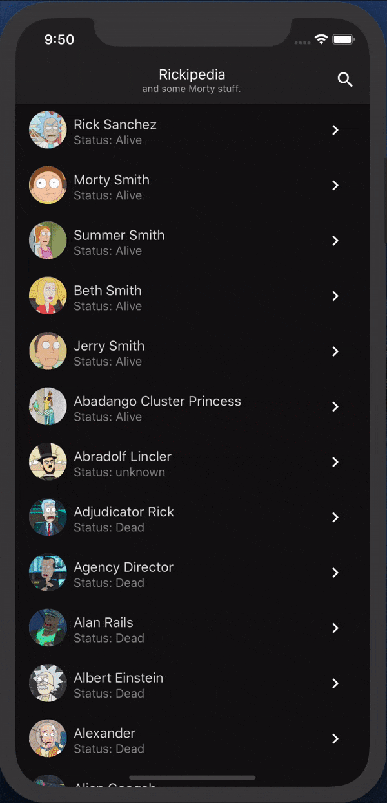

# rickipedia
Most important app all things Rick and Morty

# Intoduction
#### Rickipedia comes with endless scroll to browse through all the characters


#### When you have a certain character in mind you can directly search for it.



#### If you want to know more about a character you can select it to see some details.


#### Don't like DarkMode? Rickipedia is fully themable.


# Setup
Assuming you have a working react native development environment set up already.
After cloning the repo run the following commands from app root:
```
yarn && cd ./ios && pod update && pod install && cd .. && react-native run-ios
```
this should install the node_modules, create the pods for iOS and start the default emulator. For Android start the Simulator from Android Studio.

when making changes to, adding or deleting graphQL queries you need to run the following to update the schemas
```
yarn gql-make
```

# Testing
For unit testing Rickipedia relies on Jest in combination with react-native-testing-library. To run theme all:
```
yarn test
```

Knowing warnings issue: Apollo GraphQl mock provider, which is used to mock the backend, triggers state updates which makes Jest print the warning:
```
When testing, code that causes React state updates should be wrapped into act(...):

 act(() => {
        /* fire events that update state */
      });
      /* assert on the output */
```
The tests work fine and test what is expected but I didn't find out how to 